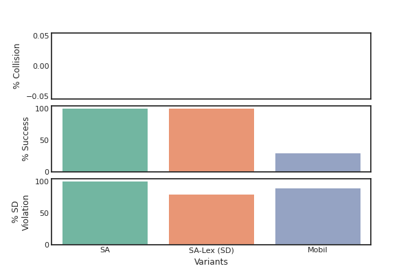

# Example Benchmark

Repository showing how to use BARK for research, e.g., conducting reproducible experiments. The core of this example repository is to run a benchmark of a single agent Monte Carlo Tree Search and compare it with MCTS variants, that incorporate penalties for violating traffic rules to their reward function. The study focuses on merging -- an arbitrary number of scenarios can be generated, where the initial positions and velocities of the vehicles are sampled randomly from a normal distribution.

## Getting started:
If you are not familar with BARK yet, check out our BARK paper [paper](https://arxiv.org/abs/2003.02604) and the code documentation [documentation](https://bark-simulator.readthedocs.io/en/latest/).
This repository uses a virtual environment just as BARK does (install via `bash tools/python/setup_venv.sh` and then source it via `source tools/python/into_venv.sh`)

## What is in there: 
There are three targets ready for execution 
* `merging_test_random`: runs N scenarios and sample the initial states randomly
* `merging_test_specific`: runs a specific scenario (you can tune them)
* `run_benchmark`: runs a full benchmark
* `scenario_tuning`: runs a lightweight benchmark with visualization to find suitable scenario generation parameters

## Benchmark
First, execute `bazel run //src/run:run_benchmark`. The results of the benchmark will be saved at 
`example_benchmark/bazel-bin/src/run/run_benchmark.runfiles/example_benchmark`. Copy the file to `results/benchmark`. The result file consists of a pandas dataframe, that represents the outcome of each benchmark simulation run. To visualize that, we have prepared an ipython notebook. You can start the notebook server via `bazel run //src/create_figures:run_notebooks` and then select the `plot_benchmark_results` notebook. The code will generate the following figure:



### Changing Parameters:
Parametrization in BARK is done via the `ParameterServer`, which reads json-files. You can tweak the existing ones:
* for the viewer in `viewer_config/params/` 
* for the behavior models in `mcts_config/params/`

Of course, those json-files are quite nested, so we provide scripts to generate them with default values. 
* for the viewer: `src/viewer_config/viewer_config_test.py`
* for the behavior models: `src/mcts_config/mcts_config_test.py`
The concept for creating parameter files can be transferred to any other object.

### Evaluators:
Evaluators can be used as a metric to analyze the benchmark, but also as a termination criterion for a simulation run. You can choose from any Evaluator in https://github.com/bark-simulator/bark/tree/master/bark/world/evaluation. Using EvaluatorLTL for example allows you to use a wide range of traffic rules.

### Scenarios:
The scenarios are generated based on the config files in `src/database/scenario_sets`. 

### Behavior Models
This example repository uses the MCTS with Rules as a sophisticated behavior model.
However, the miqp-based game-theoretic behavior model MINIVAN is also available. For this, you need to install CPLEX first, see [instructions](https://github.com/bark-simulator/planner-miqp/blob/master/README.md). 
To use this behavior model here, follow the following steps:
1. Comment in the planner_miqp repository in the deps.bzl file.
2. Load the planner_miqp_dependencies in the WORKSPACE file.
3. Activate the additional build of the behavior model and provide the path to the cplex library via `--define planner_miqp=true  --test_env LD_LIBRARY_PATH=/opt/ibm/ILOG/CPLEX_Studio1210/opl/bin/x86-64_linux`. 
4. Provide the following cplex model path via the parameter server to the behavior model `params_miqp["Miqp"]["CplexModelPath"] = "../planner_miqp/cplexmodel/"`. Provide this parameter server to the behavior model.

## Dependency Management using Bazel
As you can see in the [bark-simulator Github Group](https://github.com/bark-simulator/), the BARK ecosystem is split over multiple Github repositories. One reason for this was to keep the core functionalities light-weight and reasonably fast to build. Specifically, a lot of planning modules are placed in seperate repositories. Using Bazel as our build environment enables the reproducibility of our experiments, as dependency versions of the repositories can be tracked easily.

For example, have a look to `tools/deps.bzl`, where the specific dependencies and either their commit hashs or a specific branch can be selected. In order to try two different versions of your planner (located in another repo), you do not build or install them manually, you just need to change the commit hash.

## Cite us

This repository contains work from multiple publications: 
* Traffic Rules as Evaluators: [Formalizing Traffic Rules for Machine Interpretability](https://arxiv.org/abs/2007.00330)
* MCTS with Traffic Rules: [Modeling and Testing Multi-Agent Traffic Rules within Interactive Behavior Planning](https://arxiv.org/abs/2009.14186)
  
If you use them, please cite them. 

For everything else, please cite us using the following [paper](https://arxiv.org/abs/2003.02604):

```
@inproceedings{Bernhard2020,
    title = {BARK: Open Behavior Benchmarking in Multi-Agent Environments},
    author = {Bernhard, Julian and Esterle, Klemens and Hart, Patrick and Kessler, Tobias},
    booktitle = {2020 IEEE/RSJ International Conference on Intelligent Robots and Systems (IROS)},
    url = {https://arxiv.org/pdf/2003.02604.pdf},
    year = {2020}
}
```